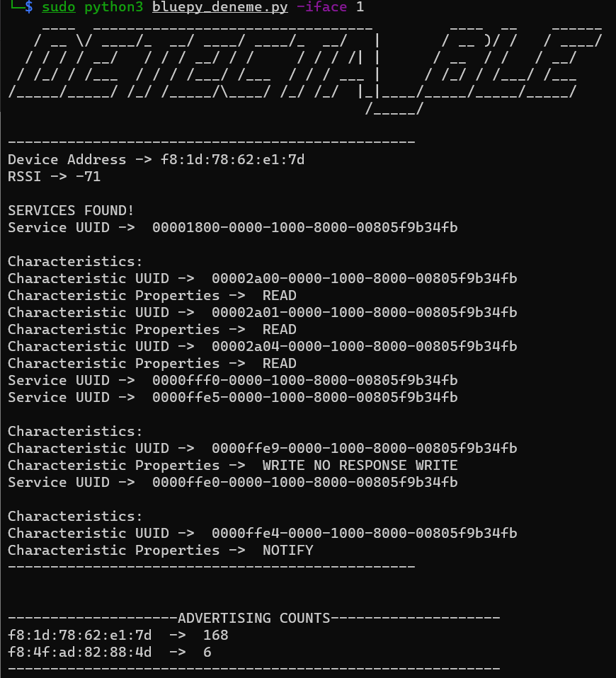

# DETECTA-BLE 🔎


Detecta-ble scans the surrounding BLE devices and extracts
their service and characteristics information.
It also keeps statistics of advertising packages
sent by BLE devices. 
## Arguments

Detecta-ble currently has 5 arguments:

1. **-t (--scan_time):** Scanning time for surrounding BLE devices (seconds) (default=10).
2. **-iface (--interface):** Bluetooth dongle iface (hciX). Type 1 for hci1.
3. **-adv (--show_adv):** Enable showing real-time *ble addresses* of advertisement packets while detecta-ble is scanning.
4. **-rssi (--show_rssi):** Enable showing real-time *rssi values* of advertisement packets while detecta-ble is scanning.
5. **-w (--write_folder):** Name of the folder if you want to keep statistics for "*advertisement packet counts per device*" and "*latest rssi values of devices*"

## Usage Examples


#### Example 1:
- Use hci1 bluetooh interface.
- Scan nearby BLE devices for 5 seconds.
```python
└─$ sudo python3 detecta_ble.py -i 1 -t 5
```

#### Example 2: 
- Use hci0 bluetooth interface.
- Scan nearby BLE devices for 20 seconds.
- Create 'BLE_STATISTICS' folder and keep statistic files in it.
- Print the BLE address for each BLE device detected during the scanning phase.
```python
└─$ sudo python3 detecta_ble.py -i 0 -t 20 -w BLE_STATISTICS -adv 
```

## Documentation

will be added soon.
  
  
## Screenshots


